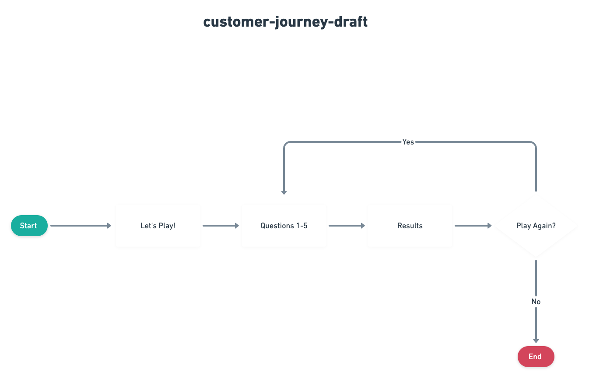
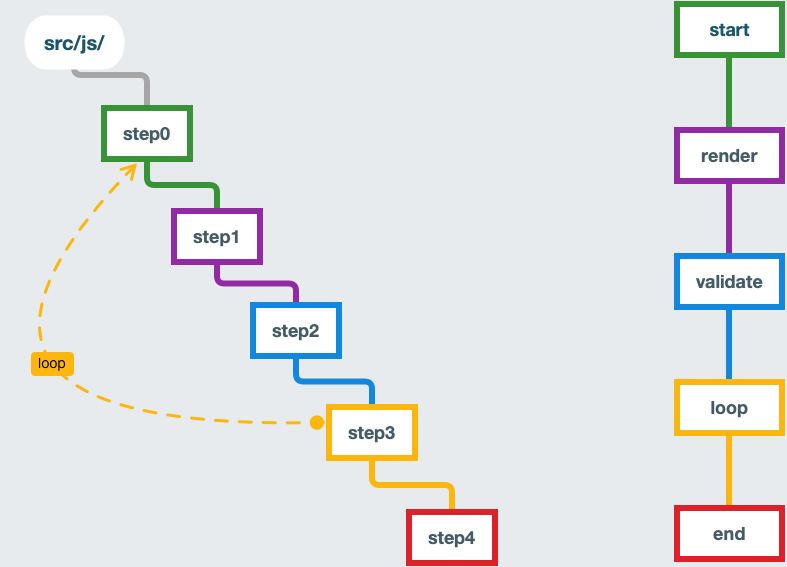
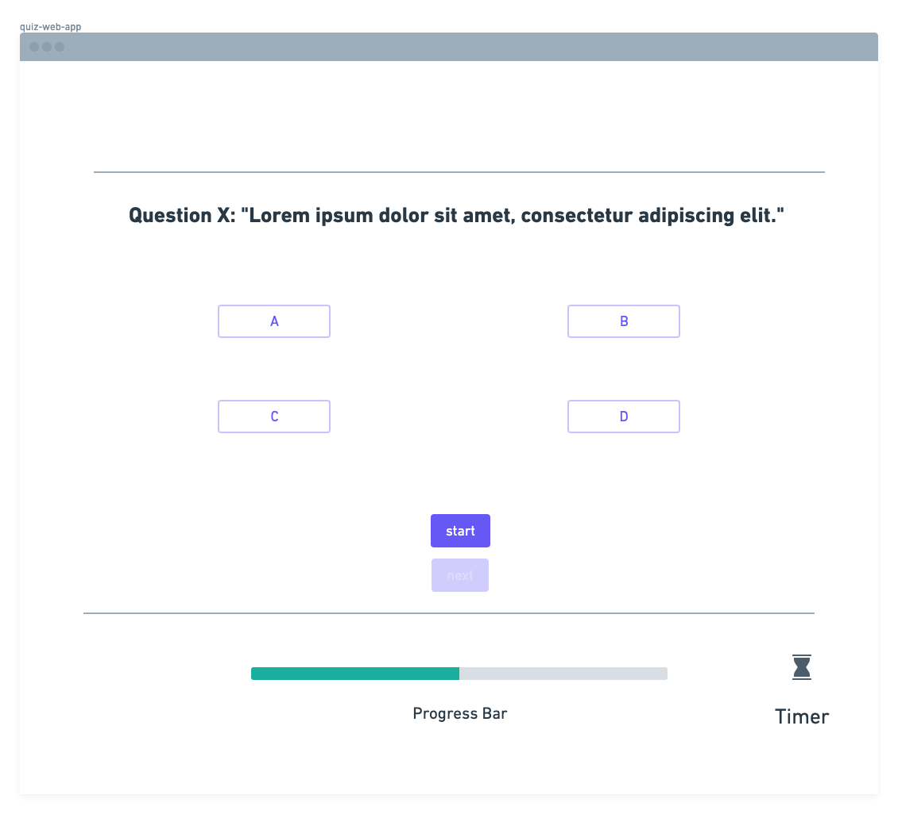

# Quiz App

- Multiple choice quiz web app built using front-end technologies with parcel web application bundler
- Project implemented during software engineering immersive bootcamp @ general assembly

---

- Hosted on netlify with continuous integration and deployment at: https://studycards.io/

---

# Getting Started

---

## Prerequisites

### NPM

```
npm i
```

### Parcel

```
npm install -g parcel-bundler
```

- More info: https://parceljs.org/

---

## Installing

### Dev

```
npm run dev
```

---

## Deployment

### Build

```
npm run build
```

## Customer Journey



## Game logic / Workflow



## Wireframe



## Sprint Board
https://trello.com/b/dEoYhGG4/sei-p1-quiz-sprint-7-13-7-17
